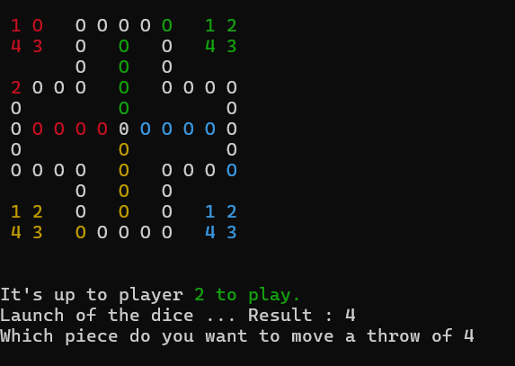

# Ludo Game - OOPS

**Team Name:** Furious 4  
- Mohammadjunaid S. Kureshi - 202401102  
- Rishi Joshi - 202401077  
- Odedara Bharat - 202401131  
- Kirtan Chaudhari - 202401095  

---

## Introduction
This project is a **Ludo Game** implemented in **C++** using **Object-Oriented Programming (OOP)** principles. It is a **console-based multiplayer** game that supports **2 to 4 players**, featuring vibrant visuals with **ANSI color codes** and smooth board rendering using **cursor manipulation**.

---

## Game Mechanics
- **Turn-Based Play:** Players take turns rolling dice and moving pieces.
- **Dice Rolling:** A random number between 1 and 6 is generated using a random function.
- **Piece Entry:** Rolling a 6 allows you to bring a new piece onto the board.
- **Capturing Opponents:** If a player lands on an opponent's piece, the opponent's piece is sent back to start.
- **Safe Zones:** Certain positions on the board are designated as safe from captures.
- **Win Condition:** The first player to move all their 4 pieces into the home zone wins.

---

## Ludo Main Path Visualization

This image represents the **main path** of the Ludo board, consisting of **40 cells** arranged in a cross-shaped layout.


## Terminal Game Visualization

This image represents the *GameVisualition*



---

## Data Structures Used

### 1. Class `Player`
- Tracks player pieces and their positions.
- Handles movement and victory conditions logic.

### 2. Class `Board`
- Renders a 2D board using ASCII characters.
- Divides the board into key zones: player base, home, and safe spots.

### 3. Class `Dice`
- Simulates dice rolls using `rand()` to generate random numbers between 1 and 6.

### 4. Class `GameController`
- Coordinates the game flow, including managing turns, updating the board, and handling interactions between players.

---

## Controls

| Key     | Action          |
|---------|-----------------|
| Enter   | Roll Dice       |
| 1 - 4   | Select Piece    |
| Q       | Quit Game       |

---

## Features & Optimizations
- **Color Coding:** Each player is assigned a unique color (Red, Green, Cyan, Yellow) for easy identification.
- **Efficient Rendering:** The game uses `SetConsoleCursorPosition()` for smooth updates without flickering.
- **ASCII Art Board:** The board is rendered using ASCII characters to represent different zones and player pieces.
- **User Feedback:** The game provides real-time feedback, including the current dice roll, the active player, and victory messages.

---
##  Time Complexity of the Ludo Game

### Per Turn Complexity – O(1)

Each player's turn involves:

- Rolling a die → constant time  
- Selecting a token (1 of 4) → constant time  
- Moving up to 6 steps (max die roll) → constant time  
- Collision checks with other tokens (max 12 others) → constant time  

All of these actions happen in constant time because the board size and number of players are fixed.

---

### Overall Game Complexity – O(T)

The game runs in a loop until one player wins. The total number of turns T depends on:

- Dice roll outcomes (luck/unluckiness)  
- Player decisions  
- Send-backs due to collisions  

Since each turn is O(1), the full game runs in *O(T)*, where T is the total number of turns taken.

---

### Board Setup & Initialization – O(1)

Functions like initBoard() and initGame() initialize fixed-size arrays.  
This is constant time work, done only once before the game starts.

## How to Compile & Run

### Requirements
- A C++ compiler (supports C++11 or later).
- A terminal with ANSI color support.

### Compile
```bash
g++ -o ludo ludo.cpp
